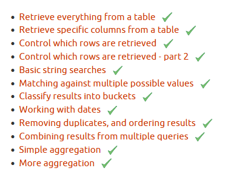

# Simple SQL Queries (Solutions)

>>> https://pgexercises.com/questions/basic





## Select all

> How can you retrieve all the information from the cd.facilities table?

```sql
SELECT *
FROM 
    cd.facilities;
```


##  Select specific

> You want to print out a list of all of the facilities and their cost to members. How would you retrieve a list of only facility names and costs?

```sql
SELECT 
    name, membercost
FROM 
    cd.facilities;
```


## Where

> How can you produce a list of facilities that charge a fee to members?

```sql
SELECT *
FROM 
    cd.facilities
WHERE 
    cd.facilities.membercost > 0
```


## Where 2

> How can you produce a list of facilities that charge a fee to members, and that fee is less than 1/50th of the monthly maintenance cost? Return the facid, facility name, member cost, and monthly maintenance of the facilities in question.

```sql
SELECT facid, name, membercost, monthlymaintenance
FROM cd.facilities
WHERE
    membercost > 0
    AND
    membercost < monthlymaintenance/50
```


## Where 3

> How can you produce a list of all facilities with the word 'Tennis' in their name?

```sql
SELECT *
FROM cd.facilities 
WHERE position('Tennis' in cd.facilities.name) != 0;
```

```sql
SELECT *
FROM cd.facilities 
WHERE name like '%Tennis%';
```


## Where 4

> How can you retrieve the details of facilities with ID 1 and 5? Try to do it without using the OR operator.

```sql
SELECT *
FROM cd.facilities
WHERE facid = 1 or facid = 5;
```

```sql
SELECT  *
FROM cd.facilities
WHERE facid in  (1,5);
```

—

> just case 
```sql
select  *
from cd.facilities
where facid in  (select facid from cd.facilities );
```


## Classify

> How can you produce a list of facilities, with each labelled as 'cheap' or 'expensive' depending on if their monthly maintenance cost is more than $100? Return the name and monthly maintenance of the facilities in question.

```sql
SELECT 
	name,
	CASE 
		WHEN monthlymaintenance > 100
			THEN 'expensive'
		ELSE 'cheap'
	END
    
FROM cd.facilities;
```

## Date

> How can you produce a list of members who joined after the start of September 2012? Return the memid, surname, firstname, and joindate of the members in question.

```sql
SELECT memid, surname, firstname, joindate
FROM cd.members
WHERE joindate >= to_date('2012-09-01', 'YYYY-MM-DD');
```

```sql
SELECT memid, surname, firstname, joindate
FROM cd.members
WHERE joindate >= '2012-09-01';
```


## Unique

> How can you produce an ordered list of the first 10 surnames in the members table? The list must not contain duplicates.

```sql
SELECT DISTINCT surname
FROM cd.members
ORDER BY surname
LIMIT 10;
```

DISTINCT - selects only unique values


## Union

> You, for some reason, want a combined list of all surnames and all facility names. Yes, this is a contrived example :-). Produce that list!

```sql
SELECT surname
FROM cd.members

UNION

SELECT name
FROM cd.facilities;
```


## Agg

> You'd like to get the signup date of your last member. How can you retrieve this information?

```sql
SELECT MAX(joindate) as latest
FROM cd.members;
```


## Agg 2

> You'd like to get the first and last name of the last member(s) who signed up - not just the date. How can you do that?

```sql
SELECT firstname, surname, joindate
FROM cd.members
WHERE joindate in (
  SELECT MAX(joindate)
  FROM cd.members
  );
```

```sql
SELECT firstname, surname, joindate
FROM cd.members
WHERE joindate = (
  SELECT MAX(joindate)
  FROM cd.members
  );
```

```sql
select firstname, surname, joindate
from cd.members
order by joindate desc
limit 1;
```


—

[Next part "Joins and Subqueries"](./joins-and-subqueries.md)